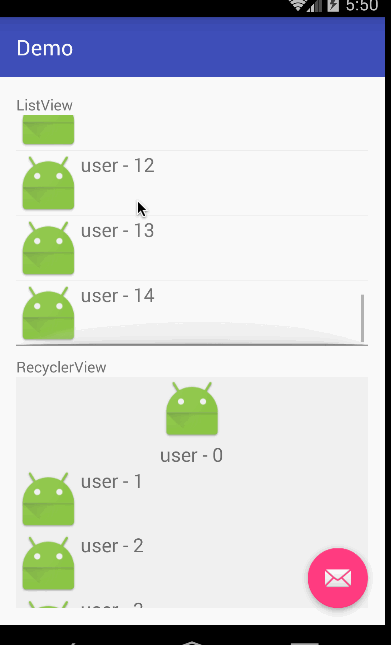

# Android Common Adapter 

> 该库用于简化AbsListView类型与RecyclerView的Adapter构建，在ListViewAdapter和RecyclerAdapter封装了固定的业务逻辑，使得用户只需要实现变化的部分即可，简化代码，避免重复的模板代码。
> 
> 该库的接口参考了[base-adapter-helper](https://github.com/JoanZapata/base-adapter-helper)，在此基础上添加了RecyclerView Adapter的支持。两种类型的Adapter之间通过桥接模式简化代码,参考[ViewHolderImpl](./app/src/main/java/com/simple/commonadapter/viewholders/ViewHolderImpl.java)。

例如，我们要实现一个适用于AbsListView的Adapter时，通常代码如下: 

```java
/**
 * Created by mrsimple on 28/9/15.
 */
public class FeedAdapter extends BaseAdapter {
    /**
     * 数据集
     */
    protected List<String> mDataSet = new ArrayList<String>();

    public FeedAdapter(List<String> datas) {
        mDataSet = datas;
    }

    @Override
    public String getItem(int position) {
        return mDataSet.get(position);
    }

    @Override
    public int getCount() {
        return mDataSet.size();
    }

    @Override
    public long getItemId(int position) {
        return position;
    }

    @Override
    public View getView(int position, View convertView, ViewGroup parent) {
        FeedViewHolder viewHolder = null;
        if (convertView == null) {
            convertView = LayoutInflater.from(parent.getContext()).inflate(R.layout.list_item_type_1, parent, false);
            viewHolder = new FeedViewHolder(convertView);
            convertView.setTag(viewHolder);
        } else {
            viewHolder = (FeedViewHolder) convertView.getTag();
        }
        // 设置数据
        viewHolder.textView.setText( getItem(position));
        return convertView;
    }

    /**
     * Feed ViewHolder
     */
    public static class FeedViewHolder {
        public ImageView imageView;
        public TextView textView;

        public FeedViewHolder(View itemView) {
            imageView = (ImageView) itemView.findViewById(R.id.imageview);
            textView = (TextView) itemView.findViewById(R.id.textview);
        }
    }
}
```
当Adapter的数量有几个时，就会反复编写getCount、getItem、getView等函数，但是它们的实现都是非常类似的，反复编写这类代码会使得代码重复率很高。Common Adapter对这些逻辑进行了二次封装，使得用户可以更方便的构建Adapter类，示例如下: 


## 1、使用代码

```java
    /**
     * 初始化ListView
     */
    private void initListView() {
        ListView listView = (ListView) findViewById(R.id.listview);
        final ListViewAdapter<String> adapter = new ListViewAdapter<String>(R.layout.list_item_type_1) {
            @Override
            protected void onBindData(GodViewHolder viewHolder, int position, String item) {

                viewHolder
                        .setText(R.id.textview, item)             // 设置文本内容
                        .setImageResource(R.id.imageview, R.drawable.big_smile) ; // 设置图片资源
            }
        };
        // 添加数据
        adapter.addItems(mockDatas());
        listView.setAdapter(adapter);
        // 设置ListView的点击事件
        listView.setOnItemClickListener(new AdapterView.OnItemClickListener() {
            @Override
            public void onItemClick(AdapterView<?> parent, View view, int position, long id) {
                Toast.makeText(MainActivity.this, "Click List : " + adapter.getItem(position), Toast.LENGTH_SHORT).show();
            }
        });
    }
```

针对于AbsListView类族的组件需要使用ListViewAdapter类型的Adapter，泛型参数就是单个实体类的数据类型。在构造ListViewAdapter对象时覆写onBindData函数完成数据的绑定即可。GodViewHolder中包含了各类View属性的设置，具体请直接查看GodViewHolder中的setter函数。

对于RecyclerView则需要使用RecyclerAdapter，使用方式与ListViewAdapter类似，示例代码如下所示。

```java
    /**
     * 初始化RecyclerView
     */
    private void initRecyclerView() {
        RecyclerView recyclerView = (RecyclerView) findViewById(R.id.recyclerview);
        // 线性
        recyclerView.setLayoutManager(new LinearLayoutManager(MainActivity.this));

        // 初始化adapter
        final RecyclerAdapter<String> adapter = new RecyclerAdapter<String>(R.layout.list_item_type_1, mockDatas()) {
            @Override
            protected void onBindData(RecyclerViewHolder viewHolder, int position, String item) {
                viewHolder.setText(R.id.textview, item);
                ImageView imageView = viewHolder.findViewById(R.id.imageview);
                Glide
                        .with(viewHolder.getContext())
                        .load("http://img4.duitang.com/uploads/blog/201402/19/20140219232639_Cda2j.thumb.600_0.jpeg")
                        .into(imageView);
            }

            // 如果有多个布局,那么覆写getItemViewType与getItemLayout即可
            @Override
            public int getItemViewType(int position) {
                return position % 5 == 0 ? 2 : 1;
            }

            @Override
            protected int getItemLayout(int type) {
                if (type == 2) {
                    return R.layout.list_item_type_2;
                }
                return R.layout.list_item_type_1;
            }
        };

        // 设置RecyclerView的点击事件
        adapter.setOnItemClickListener(new RecyclerAdapter.OnItemClickListener() {
            @Override
            public void onItemClick(int position) {
                Toast.makeText(MainActivity.this, "Click Recycler : "
                        + adapter.getItem(position), Toast.LENGTH_SHORT).show();
            }
        });
        recyclerView.setAdapter(adapter);
    }
```

在使用Common Adapter时不需要担心数据源发生改变导致列表数据不更新的问题，因为Adapter基类中将数据集设置为final,所有的数据都会添加到该数据集中；在增加、减少数据时也不需要调用notifyDataSetChanged,只需要调用Adapter对应的的addItem或者remove函数即可。

## 2、效果




